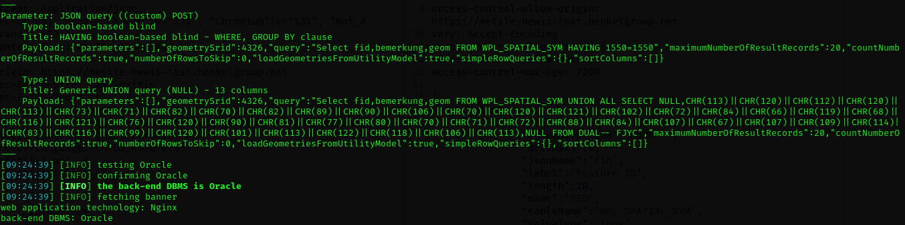

# CVE-2025-43949
MuM MapEdit application is vulnerable to SQL Injection that allows an attacker to execute malicious SQL statements that control a web application's database server.

# Affected Product & Version
Mensch und Maschine mapedit-web version: 24.2.3

Reference: https://www.mum.de/produkte/mum-mapedit

# PoC
SQLMap exploit
````
sqlmap -r sql.txt --random-agent -p query --batch --dbs
````


# Credits
This vulnerability was discovered by Manjyot Singh of Henkel Cyber Security Team.
